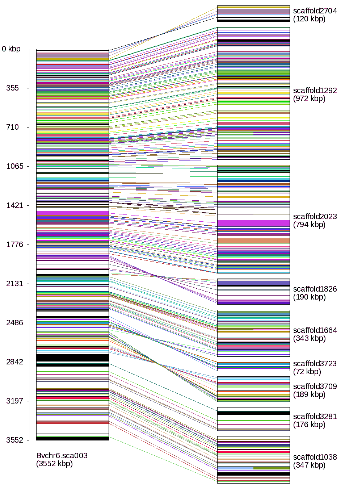
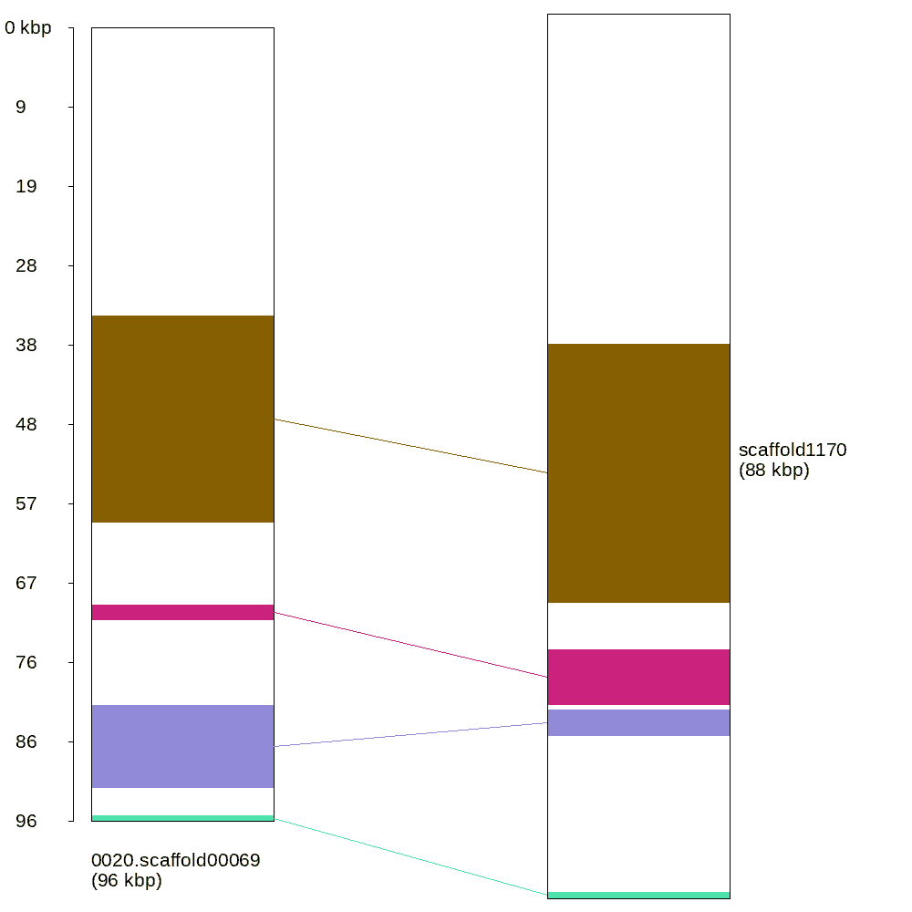
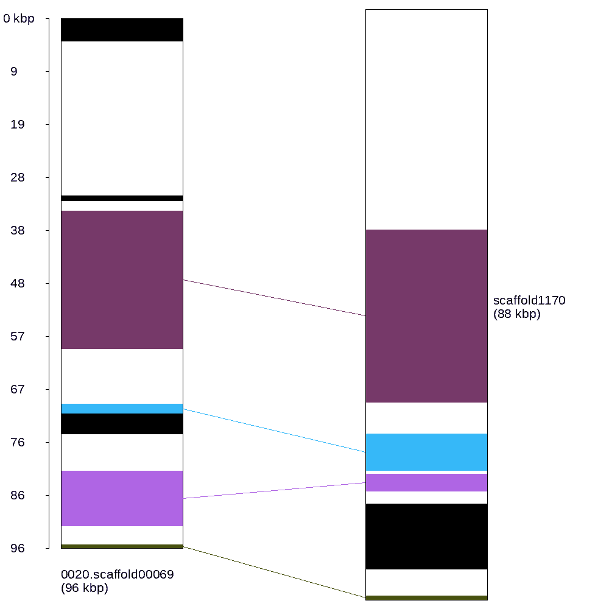

## GeneConnect

Script designed for visually representing gene collinearity between two homolog syntenic genomic segments. The figures are generated by linking genes of a reference scaffold with their homologs in the query species. For each reference scaffold, a single image is drawn.



*Example output of geneConnect for a reference scaffold containing homologs in several scaffolds of the query species.

The main input file of the program is a conection file with two columns separated by a space or tab. The first column contains the ids of the genes of the reference scaffold(s). The second column contains
orthologous gene ids of the query species, which may be in more than one scaffold. Each line represents a single gene orthology relation.

```
perl geneConnect.pl -o orthology_list.txt [ -g1 refSpecies.geneIDs] [ -g2 querySpecies.geneIds] [ -n suffix]
```

- -o file        orthology file including one gene orthology relation per line
- -g1 file       file contaning genes of the reference scaffold
- -g2 file       file contaning genes of the query scaffold
- -n             suffix to be included in the output name. If omitted the image files will have the name of the reference scaffold (and extension ".png"), otherwise "refScafName.suffix.png".

Each gene must contain the scaffold name, coordinates in the scaffold (begining and end) and the gene name. Note that these fields must be separated by double-underscore characters, and will be internally sorted (they don't need to be ordered in the files).

__Running gene_connect.pl only providing orthology file:__

```
>cat orthology.txt
0020.scaffold00069__34996__59920__Bv_000520_xuag.t1	scaffold1170__32936__58560__mar_g9410.t1
0020.scaffold00069__69976__71790__Bv_000530_rsxf.t1	scaffold1170__63346__68792__mar_g9411.t1
0020.scaffold00069__82096__92059__Bv_000550_zstx.t1	scaffold1170__73726__83471__mar_g9412.t1
0020.scaffold00069__95506__96127__Bv_000570_pmqw.t1	scaffold1170__87426__88060__mar_g9414.t1
>perl geneConnect.pl -o orthology_list.txt && display 0020.scaffold00069.no_gene_list.png
Synteny image written to "0020.scaffold00069.no_gene_list.png".
```




Alternatively, two additional files may be provided that contain the complete lists of geneIDs in the respective
scaffolds of each of the two species in one column. The orthology list as well as the additional geneID lists will be sorted by the script, i.e. they do not need to be sorted initially. If there is a gene in the gene list which does not appear in the orthology list, it will be represented without orthology relations and colored in black.


__Running geneConnect.pl providing gene lists for both scaffolds:__
```   
> cat genes_sp1.txt
0020.scaffold00069__1__4111__Bv_000500_kues.t1
0020.scaffold00069__32216__33048__Bv_000510_ffys.t1
0020.scaffold00069__34996__59920__Bv_000520_xuag.t1
0020.scaffold00069__69976__71790__Bv_000530_rsxf.t1
0020.scaffold00069__71766__75423__Bv_000540_hoty.t1
0020.scaffold00069__82096__92059__Bv_000550_zstx.t1
0020.scaffold00069__95506__96127__Bv_000570_pmqw.t1
> cat genes_sp2.txt
scaffold1170__32936__58560__mar_g9410.t1
scaffold1170__63346__68792__mar_g9411.t1
scaffold1170__69347__71875__mar_g9412.t1
scaffold1170__73726__83471__mar_g9413.t1
scaffold1170__87426__88060__mar_g9414.t1
> perl geneConnect.pl -o orthology_list.txt -g1 genes_sp1.txt -g2 genes_sp2.txt -n gene_list && display 0020.scaffold00069.gene_list.png
Synteny image written to "0020.scaffold00069.gene_list.png".
```




The script is prepared to generate whole genome synteny images automatically (see for instance http://bvseq.boku.ac.at/Genome/Download/Bpat/Synteny/). For doing so, just provide as input an orthology file containing all the orthology relations in the region of interest, regardless the number of reference scaffolds in which it appears (see http://bvseq.boku.ac.at/Genome/Download/Bpat/Synteny/RefBeet_Bpat.synteny.txt).

If you use GeneConnect for a published work, please cite:

Rodríguez del Río, Á., Minoche, A.E., Zwickl, N.F., Friedrich, A., Liedtke, S., Schmidt, T., Himmelbauer, H. and Dohm, J.C. (2019), Genomes of the wild beets Beta patula and Beta vulgaris ssp. maritima. Plant J, 99: 1242-1253. doi:10.1111/tpj.14413

